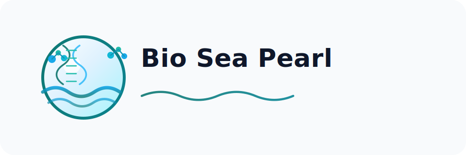

A hybrid **Python + Perl bioinformatics toolkit** for sequence alignment, Markov modeling, sequence analysis, and
FM-index–based search — unified under a single Python CLI and API.

---

## Documentation

* 📘 **Live Docs (GitHub Pages)**
  `https://bibymaths.github.io/<repo-name>/`

* 📂 Local Docs
  Located in `docs/`

---

## Quick Start

### 1. Unpack

Extract the repository:

```bash
unzip bio-sea-pearl-main-full.zip
cd bio-sea-pearl-main 

or 

git clone https://github.com/bibymaths/bio-sea-pearl.git
```

---

### 2. Install Dependencies

This project uses **Python ≥ 3.13** and **Poetry**.

```bash
pip install poetry
poetry install
```

Alternative:

```bash
pip install .
```

---

### 3. Run the CLI

The unified CLI entrypoint is:

```bash
biosea
```

Get help:

```bash
poetry run biosea --help
```

---

## CLI Usage

### Alignment

```bash
poetry run biosea align seq1.fa seq2.fa \
  --matrix alignment/scoring/blosum62.mat \
  --mode global
```

⚠️ Notes:

* Matrix filenames are **case-sensitive**
* Use `blosum62.mat`, not `BLOSUM62.mat`

Optionally, you can generate dotplot in svg format:

```bash
perl alignment/bin/dotplot.pl align.matrix.tsv dotplot.svg 
```

---

### Markov Chain

```bash
poetry run biosea markov \
  --fasta seq1.fa \
  --length 100 \
  --start A \
  --order 1 \
  --method alias
```

For higher-order models:

```bash
--order 2 --start AA
```

⚠️ Constraint:

* `start` length must equal `order`

---

### Sequence Utilities

```bash
# Hamming distance
poetry run biosea seqtools hamming ACGT AGGT

# Levenshtein distance
poetry run biosea seqtools levenshtein kitten sitting

# k-mer counts
poetry run biosea seqtools kmer ACGTACGT --k 3
```

---

### BWT / FM-Index Search

```bash
poetry run biosea bwt search \
  --sequence ACGTACGT \
  --pattern CGT
```

---

## REST API - For Very Large Sequences

Start the FastAPI server:

```bash
poetry run uvicorn api.server:app --reload
```

Endpoints:

* `/align`
* `/markov`
* `/distance`
* `/kmer`
* `/bwt/search`

Example:

```bash
curl -X POST http://localhost:8000/distance \
  -H "Content-Type: application/json" \
  -d '{"seq1": "kitten", "seq2": "sitting", "metric": "levenshtein"}'
```

---

## Project Structure

```
src/bio_sea_pearl/
├── cli.py                 # Unified CLI
├── api/                   # Clean Python API layer
├── perl_wrappers/         # Bridge to legacy Perl scripts
├── seqtools_py/           # Python ports of core algorithms
└── bwt/                   # Native Python FM-index

alignment/                 # Legacy alignment tools
markov/                    # Perl Markov models
seqtools/                  # Perl sequence utilities
api/server.py              # FastAPI layer
docs/                      # MkDocs documentation
tests/                     # Unit + integration tests
```

---

## Architecture Overview

The system is layered:

```
CLI / API
   ↓
Python API Layer
   ↓
Wrappers (subprocess)
   ↓
Perl + Python legacy tools
```

This design:

* preserves legacy code
* enables gradual Python migration
* provides production-ready interfaces

---

## Running Tests

```bash
poetry run pytest
```

---

## Troubleshooting

### Alignment fails

* Check matrix path:

  ```
  alignment/scoring/blosum62.mat
  ```
* Avoid uppercase filenames

---

### Markov fails

Error:

```
Start state must be length N
```

Fix:

```
--order N → start string length must be N
```

---

### CLI not found

```bash
poetry run biosea --help
```

or:

```bash
pip install -e .
biosea --help
```

---

## Future Work

See:

```
TODO.md
```

Includes:

* Full Python migration
* Performance optimization
* Parallel execution
* GPU acceleration
* API scaling

---

## License

This project is licensed under the MIT License. See `LICENSE` for details.
